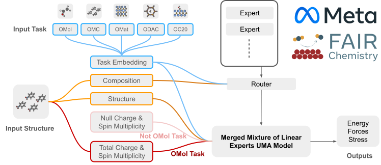

---
jupytext:
  text_representation:
    extension: .md
    format_name: myst
    format_version: 0.13
    jupytext_version: 1.16.1
kernelspec:
  display_name: Python 3 (ipykernel)
  language: python
  name: python3
---

# UMA Models

[UMA](https://ai.meta.com/research/publications/uma-a-family-of-universal-models-for-atoms/) is an equivariant GNN that leverages a novel technique called Mixture of Linear Experts (MoLE) to give it the capacity to learn the largest multi-modal dataset to date (500M DFT examples), while preserving energy conservation and inference speed. Even a 6M active parameter (145M total) UMA model is able to acheieve SOTA accuracy on a wide range of domains such as materials, molecules and catalysis. [Arxiv Paper](https://arxiv.org/abs/2506.23971)

## The UMA Mixture-of-Linear-Experts routing function

The UMA model uses a Mixture-of-Linear-Expert (MoLE) architecture to achieve very high parameter count with fast inference speeds with a single output head. In order to route the model to the correct set parameters, the model must be given a set of inputs.  The following information are required for the input to the model.

* task, ie: omol, oc20, omat, odac, omc (this affects the level of theory and DFT calculations that the model is trying to emulate) see below
* charge - total known charge of the system (only used for omol task and defaults to 0)
* spin - total spin multiplicity of the system (only used for omol task and defaults to 1)
* elemental composition - The unordered total elemental composition of the system. Each element has an atom embedding and the composition embedding is the mean over all the atom embeddings. For example H2O2 would be assigned the same embedding regardless of its conformer configuration.

### The UMA task

UMA is trained on 5 different DFT datasets with different levels of theory. An UMA **task** refers to a specific level of theory associated with that DFT dataset. UMA learns an embedding for the given **task**. Thus at inference time, the user must specify which one of the 5 embeddings they want to use to produce an output with the DFT level of theory they want. See the following table for more details.

| Task    | Dataset | DFT Level of Theory | Relevant applications | Usage Notes |
| ------- | ------- | ----- | ------ | ----- |
| omol    | [OMol25](https://arxiv.org/abs/2505.08762) | wB97M-V/def2-TZVPD as implemented in ORCA6, including non-local dispersion. All solvation should be explicit.   |  Biology, organic chemistry, protein folding, small-molecule pharmaceuticals, organic liquid properties, homogeneous catalysis | total charge and spin multiplicity. If you don't know what these are, you should be very careful if modeling charged or open-shell systems. This can be used to study radical chemistry or understand the impact of magnetic states on the structure of a molecule. All training data is aperiodic, so any periodic systems should be treated with some caution. Probably won't work well for inorganic materials.  |
| omc     | [OMC25](https://arxiv.org/abs/2508.02651) | PBE+D3 as implemented in VASP. | Pharmaceutical packaging, bio-inspired materials, organic electronics, organic LEDs | UMA has not seen varying charge or spin multiplicity for the OMC task, and expects total_charge=0 and spin multiplicity=0 as model inputs. |
| omat    | [OMat24](https://arxiv.org/abs/2410.12771) | PBE/PBE+U as implemented in VASP using Materials Project suggested settings, except with VASP 54 pseudopotentials. No dispersion.   | Inorganic materials discovery, solar photovoltaics, advanced alloys, superconductors, electronic materials, optical materials | UMA has not seen varying charge or spin multiplicity for the OMat task, and expects total_charge=0 and spin multiplicity=0 as model inputs. Spin polarization effects are included, but you can't select the magnetic state. Further, OMat24 did not fully sample possible spin states in the training data. |
| oc20    | [OC20*](https://arxiv.org/abs/2010.09990) | RPBE as implemented in VASP, with VASP5.4 pseudopotentials. No dispersion. | Renewable energy, catalysis, fuel cells, energy conversion, sustainable fertilizer production, chemical refining, plastics synthesis/upcycling | UMA has not seen varying charge or spin multiplicity for the OC20 task, and expects total_charge=0 and spin multiplicity=0 as model inputs. No oxides or explicit solvents are included in OC20. The model works surprisingly well for transition state searches given the nature of the training data, but you should be careful. RPBE works well for small molecules, but dispersion will be important for larger molecules on surfaces. |
| odac    | [ODAC23](https://arxiv.org/abs/2311.00341) | PBE+D3 as implemented in VASP, with VASP5.4 pseudopotentials. | Direct air capture, carbon capture and storage, CO2 conversion, catalysis | UMA has not seen varying charge or spin multiplicity for the ODAC task, and expects total_charge=0 and spin multiplicity=0 as model inputs. The ODAC23 dataset only contains CO2/H2O water absorption, so anything more than might be inaccurate (e.g. hydrocarbons in MOFs). Further, there is a limited number of bare-MOF structures in the training data, so you should be careful if you are using a new MOF structure. |

*Note: OC20 is was updated from the original OC20 and recomputed to produce total energies instead of adsorption energies.
