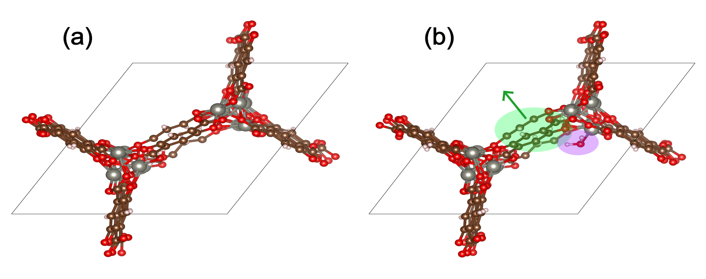

---
jupytext:
  text_representation:
    extension: .md
    format_name: myst
    format_version: 0.13
    jupytext_version: 1.17.1
kernelspec:
  name: python3
  language: python
  display_name: Python 3 (ipykernel)
---

Adsorption Energies
======================================================

Pre-trained ODAC models are versatile across various MOF-related tasks. To begin, we'll start with a fundamental application: calculating the adsorption energy for a single CO<sub>2</sub> molecule. This serves as an excellent and simple demonstration of what you can achieve with these datasets and models.

For predicting the adsorption energy of a single CO<sub>2</sub> molecule within a MOF structure, the adsorption energy ($E_{\mathrm{ads}}$) is defined as:

$$ E_{\mathrm{ads}} = E_{\mathrm{MOF+CO2}} - E_{\mathrm{MOF}} - E_{\mathrm{CO2}} \tag{1}$$

Each term on the right-hand side represents the energy of the relaxed state of the indicated chemical system. For a comprehensive understanding of our methodology for computing these adsorption energies, please refer to our [paper](https://doi.org/10.1021/acscentsci.3c01629).

## Loading Pre-trained Models

````{admonition} Need to install fairchem-core or get UMA access or getting permissions/401 errors?
:class: dropdown


1. Install the necessary packages using pip, uv etc
```{code-cell} ipython3
:tags: [skip-execution]

! pip install fairchem-core fairchem-data-oc fairchem-applications-cattsunami
```

2. Get access to any necessary huggingface gated models
    * Get and login to your Huggingface account
    * Request access to https://huggingface.co/facebook/UMA
    * Create a Huggingface token at https://huggingface.co/settings/tokens/ with the permission "Permissions: Read access to contents of all public gated repos you can access"
    * Add the token as an environment variable using `huggingface-cli login` or by setting the HF_TOKEN environment variable.

```{code-cell} ipython3
:tags: [skip-execution]

# Login using the huggingface-cli utility
! huggingface-cli login

# alternatively,
import os
os.environ['HF_TOKEN'] = 'MY_TOKEN'
```

````


A pre-trained model can be loaded using `FAIRChemCalculator`. In this example, we'll employ UMA to determine the CO<sub>2</sub> adsorption energies.

```{code-cell}
from fairchem.core import FAIRChemCalculator, pretrained_mlip

predictor = pretrained_mlip.get_predict_unit("uma-s-1p1")
calc = FAIRChemCalculator(predictor, task_name="odac")
```

## Adsorption in rigid MOFs: CO<sub>2</sub> Adsorption Energy in Mg-MOF-74

Let's apply our knowledge to Mg-MOF-74, a widely studied MOF known for its excellent CO<sub>2</sub> adsorption properties. Its structure comprises magnesium atomic complexes connected by a carboxylated and oxidized benzene ring, serving as an organic linker. Previous studies consistently report the CO<sub>2</sub> adsorption energy for Mg-MOF-74 to be around -0.40 eV [[1]](https://doi.org/10.1039/C4SC02064B) [[2]](https://doi.org/10.1039/C3SC51319J) [[3]](https://doi.org/10.1021/acs.jpcc.8b00938).

Our goal is to verify if we can achieve a similar value by performing a simple single-point calculation using UMA. In the ODAC23 dataset, all MOF structures are identified by their CSD (Cambridge Structural Database) code. For Mg-MOF-74, this code is **OPAGIX**. We've extracted a specific `OPAGIX+CO2` configuration from the dataset, which exhibits the lowest adsorption energy among its counterparts.

```{code-cell}
import matplotlib.pyplot as plt
from ase.io import read
from ase.visualize.plot import plot_atoms

mof_co2 = read("structures/OPAGIX_w_CO2.cif")
mof = read("structures/OPAGIX.cif")
co2 = read("structures/co2.xyz")

fig, ax = plt.subplots(figsize=(5, 4.5), dpi=250)
plot_atoms(mof_co2, ax)
ax.set_axis_off()
```

The final step in calculating the adsorption energy involves connecting the `FAIRChemCalculator` to each relaxed structure: `OPAGIX+CO2`, `OPAGIX`, and `CO2`. The structures used here are already relaxed from ODAC23. For simplicity, we assume here that further relaxations can be neglected. We will show how to go beyond this assumption in the next section.

```{code-cell}
mof_co2.calc = calc
mof.calc = calc
co2.calc = calc

E_ads = (
    mof_co2.get_potential_energy()
    - mof.get_potential_energy()
    - co2.get_potential_energy()
)

print(f"Adsorption energy of CO2 in Mg-MOF-74: {E_ads:.3f} eV")
```

## Adsorption in flexible MOFs

The adsorption energy calculation method outlined above is typically performed with rigid MOFs for simplicity. Both experimental and modeling literature have shown, however, that MOF flexibility can be important in accurately capturing the underlying chemistry of adsorption [[1]](https://arxiv.org/abs/2506.09256) [[2]](https://pubs.acs.org/doi/10.1021/jacs.7b01688) [[3]](https://www.nature.com/articles/nature15732). In particular, uptake can be improved by treating MOFs as flexible. Two types of MOF flexibility can be considered: intrinsic flexibility and deformation induced by guest molecules. In the Open DAC Project, we consider the latter MOF deformation by allowing the atomic positions of the MOF to relax during geometry optimization [[4]](https://pubs.acs.org/doi/10.1021/acscentsci.3c01629). The addition of additional degrees of freedoms can complicate the computation of the adsorption energy and necessitates an extra step in the calculation procedure.

The figure below shows water adsorption in the MOF with CSD code WOBHEB with added defects (`WOBHEB_0.11_0`) from a DFT simulation. A typical adsorption energy calculation would only seek to capture the effects shaded in purple, which include both chemisorption and non-bonded interactions between the host and guest molecule. When allowing the MOF to relax, however, the adsorption energy also includes the energetic effect of the MOF deformation highlighted in green.

+++



To account for this deformation, it is vital to use the most energetically favorable MOF geometry for the empty MOF term in Eqn. 1. Including MOF atomic coordinates as degrees of freedom can result in three possible outcomes:

1. The MOF does not deform, so the energies of the relaxed empty MOF and the MOF in the adsorbed state are the same
2. The MOF deforms to a less energetically favorable geometry than its ground state
3. The MOF locates a new energetically favorable geoemtry relative to the empty MOF relaxation

The first outcome requires no additional computation because the MOF rigidity assumption is valid. The second outcome represents physical and reversible deformation where the MOF returns to its empty ground state upon removal of the guest molecule. The third outcome is often the result of the guest molecule breaking local symmetry. We also found cases in ODAC in which both outcomes 2 and 3 occur within the same MOF.

To ensure the most energetically favorable empty MOF geometry is found, an addition empty MOF relaxation should be performed after MOF + adsorbate relaxation. The guest molecule should be removed, and the MOF should be relaxed starting from its geometry in the adsorbed state. If all deformation is reversible, the MOF will return to its original empty geometry. Otherwise, the lowest energy (most favorable) MOF geometry should be taken as the reference energy, $E_{\mathrm{MOF}}$, in Eqn. 1.

### H<sub>2</sub>O Adsorption Energy in Flexible WOBHEB with UMA

The first part of this tutorial demonstrates how to perform a single point adsorption energy calculation using UMA. To treat MOFs as flexible, we perform all calculations on geometries determined by geometry optimization. The following example corresponds to the figure shown above (H<sub>2</sub>O adsorption in `WOBHEB_0.11_0`).

**In this tutorial, $E_{x}(r_{y})$ corresponds to the energy of $x$ determined from geometry optimization of $y$.**

First, we obtain the energy of the empty MOF from relaxation of only the MOF: $E_{\mathrm{MOF}}(r_{\mathrm{MOF}})$

```{code-cell}
import ase.io
from ase.optimize import BFGS

mof = ase.io.read("structures/WOBHEB_0.11.cif")
mof.calc = calc
relax = BFGS(mof)
relax.run(fmax=0.05)
E_mof_empty = mof.get_potential_energy()
print(f"Energy of empty MOF: {E_mof_empty:.3f} eV")
```

Next, we add the H<sub>2</sub>O guest molecule and relax the MOF + adsorbate to obtain $E_{\mathrm{MOF+H2O}}(r_{\mathrm{MOF+H2O}})$.

```{code-cell}
mof_h2o = ase.io.read("structures/WOBHEB_H2O.cif")
mof_h2o.calc = calc
relax = BFGS(mof_h2o)
relax.run(fmax=0.05)
E_combo = mof_h2o.get_potential_energy()
print(f"Energy of MOF + H2O: {E_combo:.3f} eV")
```

We can now isolate the MOF atoms from the relaxed MOF + H<sub>2</sub>O geometry and see that the MOF has adopted a geometry that is less energetically favorable than the empty MOF by ~0.2 eV. The energy of the MOF in the adsorbed state corresponds to $E_{\mathrm{MOF}}(r_{\mathrm{MOF+H2O}})$.

```{code-cell}
mof_adsorbed_state = mof_h2o[:-3]
mof_adsorbed_state.calc = calc
E_mof_adsorbed_state = mof_adsorbed_state.get_potential_energy()
print(f"Energy of MOF in the adsorbed state: {E_mof_adsorbed_state:.3f} eV")
```

H<sub>2</sub>O adsorption in this MOF appears to correspond to Case #2 as outlined above. We can now perform re-relaxation of the empty MOF starting from the $r_{\mathrm{MOF+H2O}}$ geometry.

```{code-cell}
relax = BFGS(mof_adsorbed_state)
relax.run(fmax=0.05)
E_mof_rerelax = mof_adsorbed_state.get_potential_energy()
print(f"Energy of re-relaxed empty MOF: {E_mof_rerelax:.3f} eV")
```

The MOF returns to its original empty reference energy upon re-relaxation, confirming that this deformation is physically relevant and is induced by the adsorbate molecule. In Case #3, this re-relaxed energy will be more negative (more favorable) than the original empty MOF relaxation. Thus, we take the reference empty MOF energy ($E_{\mathrm{MOF}}$ in Eqn. 1) to be the minimum of the original empty MOF energy and the re-relaxed MOf energy:

```{code-cell}
E_mof = min(E_mof_empty, E_mof_rerelax)

# get adsorbate reference energy
h2o = mof_h2o[-3:]
h2o.calc = calc
E_h2o = h2o.get_potential_energy()

# compute adsorption energy
E_ads = E_combo - E_mof - E_h2o
print(f"Adsorption energy of H2O in WOBHEB_0.11_0: {E_ads:.3f} eV")
```

This adsorption energy closely matches that from DFT (–0.699 eV) [[1]](https://arxiv.org/abs/2506.09256). The strong adsorption energy is a consequence of both H<sub>2</sub>O chemisorption and MOF deformation. We can decompose the adsorption energy into contributions from these two factors. Assuming rigid H<sub>2</sub>O molecules, we define $E_{\mathrm{int}}$ and $E_{\mathrm{MOF,deform}}$, respectively, as

$$ E_{\mathrm{int}} = E_{\mathrm{MOF+H2O}}(r_{\mathrm{MOF+H2O}}) - E_{\mathrm{MOF}}(r_{\mathrm{MOF+H2O}}) - E_{\mathrm{H2O}}(r_{\mathrm{MOF+H2O}}) \tag{2}$$


$$ E_{\mathrm{MOF,deform}} = E_{\mathrm{MOF}}(r_{\mathrm{MOF+H2O}}) - E_{\mathrm{MOF}}(r_{\mathrm{MOF}}) \tag{3}$$


$E_{\mathrm{int}}$ describes host host–guest interactions for the MOF in the adsorbed state only. $E_{\mathrm{MOF,deform}}$ quantifies the magnitude of deformation between the MOF in the adsorbed state and the most energetically favorable empty MOF geometry determined from the workflow presented here. It can be shown that

$$ E_{\mathrm{ads}} = E_{\mathrm{int}} + E_{\mathrm{MOF,deform}} \tag{4}$$

For H<sub>2</sub>O adsorption in `WOBHEB_0.11`, we have

```{code-cell}
E_int = E_combo - E_mof_adsorbed_state - E_h2o
print(f"E_int: {E_int}")
```

```{code-cell}
E_mof_deform = E_mof_adsorbed_state - E_mof_empty
print(f"E_mof_deform: {E_mof_deform}")
```

```{code-cell}
E_ads = E_int + E_mof_deform
print(f"E_ads: {E_ads}")
```

$E_{\mathrm{int}}$ is equivalent to $E_{\mathrm{ads}}$ when the MOF is assumed to be rigid. In this case, failure to consider adsorbate-induced deformation would result in an overestimation of the adsorption energy magnitude.

## Acknowledgements & Authors

Logan Brabson and Sihoon Choi (Georgia Tech) and the OpenDAC project.
